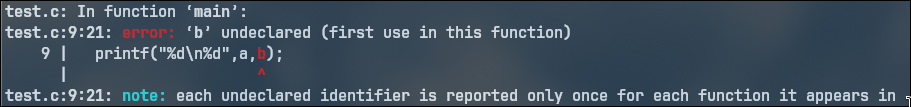

# DSA stands for Data Structures and ALgorithms 
Being good at DSA should mean that you are good at use data structures and algorithms to solve a problem in most optimal way possible .  
It is usefull as it increases the thinking ability of a human to solve a problem in the given resources / utilizing the given resources to meet the requirements and also have a good performance.  

This page teaches you - I wouldn't say all - but something that would be enough to last a human life time | <br> In order to get better at programming logics I use OOPs as well | <br> learn shell scripting BTW , it drastically increases your programming power | <br> what is shell scripting ? , bruh are you using windows [buhahaha , That's what few linux user would say but, I am different I do like windows for what it is - if someone wants something else they can have something else. What I meant was - are you using buttons ? I am still unemployed and I might also be able to give interviews to microsoft so I guess I shouldn't stay stuff like that .No offence to windows I wanted to say / I meant GUI . BTW imagine - me an arch linux user giving interview to microsoft, I really like windows  - its good and stuff , Its support to run certain executables is the best feature like games . And there are other good things like security , anti virus features etc.]?


To make the learning the way it has to be and not by some outdated types like sitting in  a room and just using pen paper - I introduce the idea of shinobi ranking , <br> You have to compete studying through one level to reach a level / unlock a level that's above it - obv there are no restrictions / constraints - it is just a convention - if you cheat , you still know where you stand | <br> passing level would be if you understood everything till the level of a KAGE 

# Genin [naruto] level on the header show level and show images of characters to jump to levels


# Analyse the Problem 
##### Understand the problem. Take a second to recall whatever you learnt in relevance with the problem

# Deduction 
##### Think of the specific problem statement -> break it down to simpler parts -> think of the solution to simpler parts -> combine the solution 

# Flowchats
##### Most important part of problem solving is on paper . . . that is where 80% of the problem is solved from easiest to the most difficult problem 

# Always document the process
##### Helps you keep going throught the topics like a Flow !

# Basic problems
### parity checker
### largest of 3 numbers
### primality
### largest of 3 numbers 

# Java

Java is platform independent  and hence its class files can be circulated across machines without tampering 
> ![WARNING] Though JDK is convert those class executables into machine code . A higher lower version of JDK cannot convert a .class file into machine code that was compiled by a higher version of JDK


<br><br><br>
JDK = JRE+Compiler+docs <br>  
JRE contains JVM<br>

# Different mahcines has different JVMs but JDK is smart enough to compile other machine .class into machine code 

# Java does support foward reference 

# C doesn't

<br><br><br><br><br>
# DATATYPE

| datatype | size on ram |
|:--------|:----------:|
| short | 2 bytes  |
| int   | 4 bytes  |
| long  | 8 bytes  |
| byte  | 1 byte  |
| flaoting | points |
| double | 8 bytes [higher precision]  |
| float  | 4 bytes  |
| characters |         |
| char  | 2 bytes  [c takes 1 byte - minimal mahn]  |
| boolean | typically 1 bit  |

##### characters are stored in the form of ASCII values

# Conversion [typeCasting]
#####  Implicit conversion is done from type of lower or equal size to higher size of type.
Narrowing conversion the upper one - explicitly declare it , if you want the conversion , else just show it in desired form while printing ```(char)a``` where a is an int
```bash
int i=0;
float p=i;
```
##### If you want to convert to lower size type you need to explicitly mention that 
```bash
int i=0;
char p=i;
```
```bash
int i=0;
char p=(char)i
```

# Precedence of operators in JAVA
[operatorPrecendenceJava](https://docs.oracle.com/javase/tutorial/java/nutsandbolts/operators.html)  
[moregraphical](https://www.javatpoint.com/java-operator-precedence)  <br><br>

# Scanner
[scanner](https://docs.oracle.com/javase/8/docs/api/java/util/Scanner.html)
[commonly used scanner](pics/scanner.png)

# Scope of Variables
##### when variables are initialized inside a loop, its only available there not even outside the loop in the same function
```
#include<stdio.h>

int main(){
  int a=10;
  if(a>0){
    int b=20;
  }

  printf("%d\n%d",a,b);
}
```
<br>


 / document the practise problem that is the patterns ones and etc in some squid game manner like how the pink soldiers ask for square or triangle etc....


# Bitwise operators

  ```java
int a=10;
int b=2;

System.out.println(a&b);
System.out.println(a|b);
System.out.println(a^b);
System.out.println(~a);// "~" this is the complement operator
System.out.println(a << 2); // left shift by 2 raised to 2 , as it is converted into binary that is essentailly "a*(2**2)".  <br> For ex - 6 << 2 is 
// 6 - 0000110  
// 2 left shifts makes - 0011000 = 24  
// which is 6*(2**2), 6*4=24
System.out.println(a >> 2); // right shift i.e. -4
```
Convert the values of variables to binary then perform the specified operations and you will get the result.   
Make use of few properties such as  : a^a=0, since all the bits are same  
a^0=a.


# Loops / functions 
Pratise this for better understanding of loops   

++i , increments before using i  

i++ , increments later 

mostly usefull in print statements  
since 


if you do 
```c
i=5;
i++;
// [or] ++i;
printf("%d",i);
// There will be no change
```
in for loops  
1.  initialises the var , no matter what. The first value of the var is the value initialised in the parameters of the loop [cuz point 4]

2.  checks the condition ; if true goes into the body 

3. executes the body  

4. now performs what ever opetaion is mentioned in the for loop 

5. goes to step 2

> ![NOTE] the comparision step in a for loop is done n+1, the last time is for the rejection take the following as an example: 
```java
int i=1;
for(;i<n;i++)
 System.out.println(i);// this prints till 5
System.out.println(i); // this prints till 6 , cuz i++ , i got incremented but rejected by the condition step , though it is still a function variable and not a loop variable , the trace is kept by the function and the incremented value is printed

```


```java

int a=60,b=80;

if(a++ >60 && b++ > 80 ){
  System.out.println("Inside if");
}
else{
System.out.println("Inside else");
}

System.out.println("a: "+a+" "+"b: "+b);
```
```
Inside else
a: 61 b:80
```
since a is incremented after being processed 60 is not > 60 so inside else  
logical operators uses short-circuit and hence since first part is taken as not true the remaining part is unnecessary to evaluate and hence skips that part - which essentially skips the part where b is incremented and b remains 80!


# Patterns


## Square patterns 
## Trianlge
## characters
## pyramid


# Pass by value

```java
public static void increment(int n){
 n++
}

// in main

increment(n);

// n won't increment since n's value is passes and not n itself and hence n's value is incremented and not n , to be more precise the local varible of the increment function was incremented
```

The fix to this is by using pointers in C

# Function Overloading

```java

public static int sum(int a, int b){
return a+b;
}
public static double sum(int a, int b){// not possible , same parameters are already defined in another function of the same name
return a+b;// though if this was the only function make sure to pass int to it and it will return the double
}
public static int sum(int a){ // works
return a;
}

```


# chunin level [add genin pic at the start of this page] [for chunin add chunin pics] -- mention chunin , jounin , Anbu , S ranked , KAGE , Sanin , WarHeroes [obito-madara-might guy] , unknown potential [sakumo hatake, shisui, minato] , Itachi/Light


# add takamura somewhere as a level in website 


<br><br><br><br><br>
LINEAR DATA | NON LINEAR DATA

## LINEAR DATA

