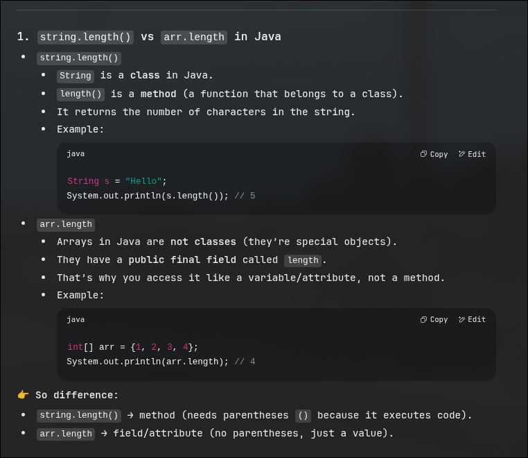

# Chunin [Shikamaru]

- arrays are initialised as zeros by default.  
- when you print array without referencing any index , its prints the reference address of the array.  
- arrays store reference and length , that is why we call length by ```<Arraryname>/length```
- A boolean is stored as either "true" or "false" and not 0 or 1

| name | 1stBlock | 2ndBlock|
| ------------- | -------------- | -------------- |
| array | reference | length |


## Primitive and Non- Primitive data types
### Primitive 

- predefined by the language
- fixed size and behavior
- directly stores the values

ex:
- int  
- float/ double  
- character  
- boolean 
- string [strings in java are immutable | but can be concatenated]

primitive data typed str passed by values.  

### Non primitive 

that are derived or constructed using primitve data types  

- user-defined or built on top of primitve data types  
- can store multiple values or more complex data  
- flexible and often dynamic  

ex: 
- arrays  
- lists  
- tuples  
- sets  
- dictionaries  
- classes/objects  
- pointers 

Non primitive data types are stores and manipulated as call by reference so you can pass references to functions and no need to specify a particular value

## Easy problems  
### find largest element 
### merge arrays 


## Searching

### Linear Search 

### Binary Search  

> ! [WARNING] The array needs to be sorted for binary search to work.  

> [NOTE] when performing a function , make sure to make a return type , void is problematic -- [see searchingInArrays.problematic]  
  also note the power of ```return``` statement.    


## Sorting

### Selection sort  

you select the first index at every indices and find the minimum value in the array for that place 
- the values from start till the index are sorted  

### bubble sort 

you are selecting consecutive indices and swapping if the smaller index holds a greater value
- after each iteration proportionally the last elements are sorted 

### Insertion sort

assume that the first index is sort and from the second index take the first value and compare with the indices before it and place it , keep increasing the index of the assumption of sorted part 

## Strings

can be stores in two way - 

```java
char arr[]={'H','E','L','L','O'}; 
String str="Hello"; // string pool [will learn about it further]
String str1="";
System.out.println(str1.length()+" "+str.charAt(0))
System.out.println(str1 + str2)
System.out.println(str1.equalts(str2) );
str1=str1.concat(str2);
System.out.println(str1.comapreTo(str2));
// return ascii difference between those values 
System.out.println(str.contains(str2));
System.out.println*(str.substrin(3));
// give the starting index from where you want the substring
System.out.println*(str.substrin(3,4));
// start , end (end is exclusive)
str3=s.next(); // delimiter is space here , the remaining part after the delimiter is kept in the console waiting for the next function to take it as input.
System.out.println(str3+" "+str3.length);
str4=s.nextLine(); // delimiter is \n here , now only takes what ever is remaining in the console
System.out.println(str4+" "+str4.length);
```

### reversing strings

\# write code for the following as a practise

1. where i is n and you store the value of i in a new string and decrement i   

2. where i is 0 and keeps incrementing till less than str.length. and prepends every character it find ,
```java
recstr=str.charAt(i) + revstr
```

3. where i is 0 and keeps incrementing while its less than str.length , while copying its (n-i) contents to a new string 

### Pallindrome

1. reverse the entire string and match it with the original. You can use a compare to operator - if the returned value is 0 , its same.  
Here you reverse the first half of the string so its time complexity is n/4.
2. Check the last characters corresponding to the first characters , <br> *if they match* <br> &nbsp;&nbsp;&nbsp;&nbsp; - decrement last character and increment first character while first character's index is less than last character's index <br> *else* <br>&nbsp;&nbsp;&nbsp;&nbsp; the string is not a pallindrome , <br> once the loop has executed - check the first and last indices , <br> if they are equal to or first is less than last index then they match !

##### revise : strings are immutable but can be concatenated 

#### Functions/Function calls , non primitive objects and local variables are stored in stack

#### Actual content or values are stored in heap  

### Declaring a string  
```java
string str="abc"; //  string pool 
String str1 = new String("abc") // object : value string 
char str2 = new char[10] ; // object :value string
```

- Using a string pool , the length function is ```str.length()``` ,  as it is a primitive type , generally non primitive types like array have ```arr.length```   <br>

Difference between length() and length 
and 
String and char 
[class]   [data type]



- str1 here is the reference in the stack and "abc" stored is the value stored in the heap which is being referred to by the stack value [i.e. address of ] str1.  <br> 

- while str is creating a new value in the heap [creating - because no value was present before that matched that value required by str] which is called as string pool.  <br>
- The concept of string pool is in java cuz - when another string called for the same value - it will just refer to the heap location.  

\# So yes, basically string pool is in heap.  

### Substring 

A substring is a subset of a string whose order / sequence is maintained.  

*formula for* total number of sub strings = sum of n natural numbers = ```n(n+1)/2```

### String compare 

use ```str.equals(str2)```

instead of ```str == str2``` as this way it doesn't no compare and the string but the address these variables refers to , This condition only occurs when one of them is a non primitive type as primites are called by values - non primitve way of declaring a string is by creating a new instance of the String class .

### String buffer

String buffer class is a special string class which makes string mutable , most commonly used operation - ```str.setCharAt(index,character)```  
String buffer is a non primitive data type  so its a pass by reference +  takes more space as it has data manipulation support  
```str.append("character[s]")``` is what is available instead of ```str.concat(str2)``` 

### String builder 


### String buffer vs String builder


### String programs 

#### reverseEarchWord

#### Find number of substring - 2 approaches 


## 2D-Arrays

- Arrays in java are generally initialized to 0;   
- Here the ```arr``` stores the length and reference to other sub-1D arrays ,
- To find total elements you need to sum ```sum+=arr[i].length```
- by this time you will also know it by default that this is also a non-primitive take , if not you should just go back to the [academy][../pics/academy.jpg]

### Declaring 

```java
int[][] arr = {{1,2},{3,4,5}};
```

This short hand declaration is allowed only at the time of declaring the array and not later i.e.  

```java
int[][] arr= new int[10][10];
arr[][] = {{1,2},{3,4,5}} // not possible 
arr[0][] = new int[]{1,2}; // instead use this
arr[1][] = new int[]3,4,5; // This is called as jagged arrray 
```

- Where as 

```java
int [][] arr = new int[5][];
System.out.println(arr); // returns a value since the array is referenced somewhere in the memory that references 5 more arrays 
System.out.println(arr[0]);// return null as no address is referenced for the 1st sub-1Darray of main 2D-array
System.out.println(arr[0][1]);//  since there is no reference to the 1st array , the second element of the first array is NULL and hence could return a null pointer exception
```

### Jagged Arrays 
```java
int arr[][] = new int[5];
System.out.println("5 arrays declared whose reference is : "+arr);
for(int i=0;i<5;i++){
    arr[i] = new int[3]; // or any value desired    
    // i th array of j elements have been decalred
}
for(int i=0;i<5;i++){
    for(int j=0;j<arr[i].length;j++){
        System.out.println(arr[i][j]);
    }
}
```

