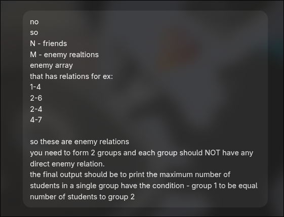

# TODO 

- [ ] find the spanning tree in a graph/tree [whatever] and output number of spanning trees. 
- [ ] given an unsorted array find the minimum number of swaps required to swap so that all the digits have its [value+1] digit to its adjacent side 
for ex: [8,1,7,2,4,5,6,3]
    sol: [1,2,3,4,5,6,7,8] or [8,7,6,5,4,3,2,1] maybe there can be more 🤔 

- [ ] fault count 4 problem 
- [ ] Two groups question 

- [ ] nQueens forbidden
- [ ] remember what to revise while free time
- [ ] make cheatsheet for dsawcbook [ beginner's cheetsheet ]   
 - [ ] take questions from exercises  
 - [ ] cyclic , acyclic, connected , disconnected, digraph , undirected ...
- [ ] think of using striver?
- [ ] kadan's algorithm
- [ ] That barbell question
https://leetcode.com/problems/maximum-depth-of-binary-tree/
- [ ] Check the previous codes and codes from 3-4sems
